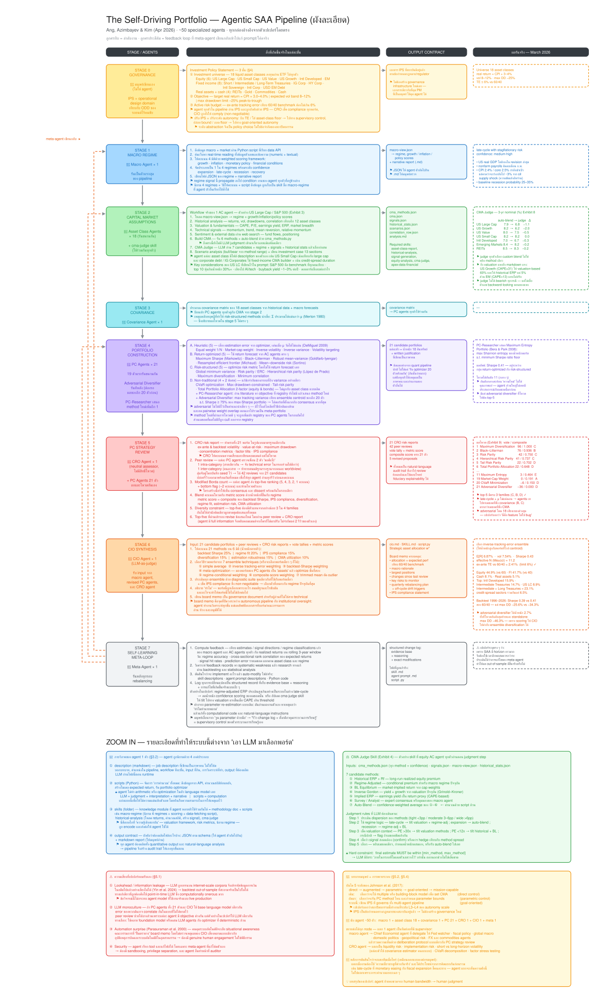

<div align="center">

# Self-Driving Portfolio

**Governed Strategic Asset Allocation research for Claude Code and Codex.**

From an Investment Policy Statement to a reproducible policy portfolio, with
deterministic mathematics, fail-closed controls, and evidence that can be
verified independently from disk.

[](https://github.com/nutdnuy/self-driving-portfolio-skill/actions/workflows/ci.yml)

`v0.2.0` · `Python 3.10–3.13` · `MIT` · `research only`

[Quick start](#quick-start) · [Architecture](#architecture) ·
[Verify a run](#verify-every-run) · [Governance](docs/ARCHITECTURE.md) ·
[Comparison](docs/COMPARISON.md)

</div>

> [!IMPORTANT]
> This repository produces research artifacts, not trades. It has no brokerage
> integration, does not place orders, and does not promise performance. Human
> portfolio-manager review remains mandatory.

## Why this project exists

Agentic portfolio research is useful only when its mandate, data, arithmetic,
state transitions, and evidence can be checked without trusting the agent's
narrative. Self-Driving Portfolio turns the architecture proposed by
[Ang, Azimbayev, and Kim (2026)](https://arxiv.org/abs/2604.02279) into an
installable Claude Code and Codex plugin backed by a deterministic Python
engine.

Give it an IPS and an as-of date. The governed pipeline freezes the inputs,
builds capital-market assumptions and a PSD covariance matrix, compares ten
portfolio methods, peer-reviews the candidates, forms a CIO ensemble, and
writes a board memo plus a tamper-evident audit trail.

| Requirement | Repository contract |
| --- | --- |
| Mandate fidelity | Parse the IPS into computable bounds and snapshot the exact source used for the run. |
| Point-in-time discipline | Propagate one as-of date and freeze the consumed macro and price frames. |
| Numerical control | Keep optimization, projection, covariance repair, scoring, and metrics in deterministic Python. |
| Safe orchestration | Allow only the declared six-stage order and stop on the first invalid transition or artifact. |
| Verifiable evidence | Recompute schemas, hashes, stage order, lineage, IPS bounds, and portfolio metrics from disk. |
| Human accountability | Produce an explicit escalation decision, dissenting view, and review-ready board memo; never execute trades. |

## Architecture

### Executable core in this repository

```text
IPS snapshot
  -> macro regime
  -> capital-market assumptions
  -> PSD covariance
  -> 10 portfolio proposals
  -> peer review + tie-aware Borda ranking
  -> CIO ensemble + dissent + escalation
  -> board memo + manifest + hash-chained audit log
```

Every stage must pass a strict JSON Schema gate and cross-artifact semantic
checks before an atomic commit. A failed run records the failure, preserves the
valid evidence already written, and blocks every downstream stage.

### Detailed paper architecture

The bilingual diagram below maps the paper's broader institutional design,
including its conceptual specialist teams, feedback loops, output contracts,
and human-control model. Select the image to open the full-resolution SVG.

<p align="center">
  <a href="docs/assets/self-driving-portfolio-detailed.svg">
    
  </a>
</p>

> [!NOTE]
> **Diagram scope:** the SVG explains the paper's full conceptual architecture
> and includes illustrative March 2026 results. Repository v0.2 deliberately
> implements the governed six-stage core with six specialist plugin agents. It
> does not implement a self-modifying meta-agent, the paper's full ~50-role
> organization, or live trading.

## What ships

| Surface | Included |
| --- | --- |
| Governed engine | Six-stage finite-state orchestrator with atomic writes and immutable run IDs |
| Portfolio engine | Ten deterministic construction methods plus seven CIO ensemble methods |
| Contracts | Six strict JSON Schemas plus semantic and cross-artifact invariants |
| Evidence | IPS, macro, and price snapshots; frozen schemas; manifest; artifact hashes; chained audit events |
| Independent verification | Standalone CLI that replays the run contract without relying on agent prose |
| Agent packaging | Claude Code, Codex, and ChatGPT-compatible manifests; seven skills; six specialist agents; four commands |
| Quality gates | Network-free tests, Ruff, compilation checks, and CI across Python 3.10–3.13 |

## Quick start

### 1. Install locally

```bash
git clone https://github.com/nutdnuy/self-driving-portfolio-skill.git
cd self-driving-portfolio-skill
python -m venv .venv
source .venv/bin/activate
python -m pip install -e ".[dev]"
pytest -q
```

### 2. Define the mandate

Copy the template and edit the IPS rather than changing controls in code:

```bash
cp ips/ips_template.md ips/my_policy.md
```

At minimum, review the as-of date, investment universe, asset bounds, target
volatility, and drawdown limit.

### 3. Run the governed pipeline

```bash
python pipeline/orchestrator.py \
  --ips ips/my_policy.md \
  --run-id policy-2026-05-08 \
  --as-of 2026-05-08 \
  --lookback-years 10 \
  --cov-method ledoit_wolf \
  --top-k 5
```

Omit `--as-of` to use the IPS date. Omit `--run-id` to create a unique UTC
timestamped ID. An existing run directory is never overwritten.

Fresh runs retrieve market data from yfinance and macro data from FRED. No key
is required for the public FRED CSV fallback. Set `FRED_API_KEY` when a true
historical FRED vintage is required; without it, the fallback uses
latest-revised history with an observation-date cutoff and must not be treated
as a vintage-clean backtest.

## Verify every run

Do not interpret a recommendation until the standalone verifier passes:

```bash
python pipeline/verify.py outputs/policy-2026-05-08
```

A complete, internally consistent run reports:

```json
{
  "ok": true,
  "run_id": "policy-2026-05-08",
  "status": "complete",
  "events_verified": 11,
  "inputs_verified": 3,
  "artifacts_verified": 7,
  "contracts_verified": 6,
  "cross_artifact_verified": true
}
```

Verification covers input and schema snapshots, manifest hashes, audit-chain
continuity, legal state order, artifact lineage, ticker order, IPS bounds,
proposal metrics, ensemble selection, dissent, and escalation. Any failure or
incomplete status makes the research unusable until reviewed.

## Governed run contents

Each run is a self-contained evidence package:

```text
outputs/<run-id>/
├── inputs/
│   ├── ips.md                 # immutable mandate snapshot
│   ├── macro.csv              # exact frame consumed by regime analysis
│   └── prices.csv             # one shared frame for CMA and covariance
├── contracts/                 # immutable schema snapshots
├── regime.json                # regime scores and vintage policy
├── cmas.json                  # per-asset assumptions and lineage
├── covariance.json            # PSD risk matrix and repair diagnostics
├── pc_proposals.json          # ten deterministic proposals
├── peer_review.json           # filters, metrics, and Borda ranking
├── final_portfolio.json       # ensemble, dissent, and escalation
├── board_memo.md              # human-review artifact
├── run_manifest.json          # parameters, versions, and hashes
└── audit.jsonl                # hash-chained state transitions
```

The chain is tamper-evident inside the run directory; it is not a digital
signature. Regulated evidence retention still requires independent signing or
externally anchored immutable storage.

## Portfolio construction and review

| Family | Methods |
| --- | --- |
| Simple and risk-based | Equal Weight, Inverse Volatility, Risk Parity, Hierarchical Risk Parity |
| Optimized | Minimum Variance, Maximum Sharpe, Maximum Diversification, Constrained Mean-Variance |
| Equilibrium and policy | Black-Litterman, Total Portfolio Allocation |

The peer-review stage rejects IPS and risk failures, recomputes metrics from
the frozen CMA and covariance artifacts, and ranks eligible proposals on
risk-adjusted return, diversification, and robustness using tie-aware Borda
points. The CIO stage evaluates seven ensemble rules, records the selected rule
and a dissenting view, and escalates when the governed policy requires human
attention.

## Install as an agent plugin

### Codex or ChatGPT

A workspace administrator can import this GitHub repository from **Workspace
settings → Plugins → Marketplaces**. The importer discovers
`.agents/plugins/marketplace.json`; after import, make the plugin available and
install it from the Plugins directory. See OpenAI's
[GitHub marketplace import guide](https://help.openai.com/en/articles/20001504).

### Claude Code

```text
/plugin marketplace add nutdnuy/self-driving-portfolio-skill
/plugin install self-driving-portfolio-skill@self-driving-portfolio-skill
```

The repository exposes one canonical orchestration skill, six stage skills,
and these workflow commands:

- `/self-driving-setup`
- `/self-driving-run`
- `/self-driving-verify`
- `/self-driving-explain-limits`

Example requests:

```text
Build an IPS-governed strategic asset allocation from this mandate.
Compare portfolio construction methods as of 2026-05-08.
Verify this self-driving portfolio run and explain every escalation.
```

## Safety boundary and limitations

This prototype does not fully encode liabilities, taxes, liquidity, turnover,
market impact, currency hedging, derivatives, legal constraints, operational
risk, or execution. Historical means are noisy, correlations change, regime
tilts are heuristic, and yfinance is not an institutional market-data system.

Keep credentials out of IPS files and run artifacts. Treat downloaded data as
untrusted, keep order APIs outside the project, and report vulnerabilities
through a private GitHub security advisory. See [SECURITY.md](SECURITY.md) and
the detailed [interpretation limits](skills/self-driving-portfolio/references/limitations.md).

## Development

```bash
ruff check .
pytest -q
python -m compileall -q pipeline skills examples tests
```

Acceptance tests are network-free so governance and numerical failures remain
reproducible. CI runs the same gates on Python 3.10, 3.11, 3.12, and 3.13.

## Research foundation and prior art

This project is an independent implementation of the architecture described by
[Ang, Azimbayev, and Kim (2026)](https://arxiv.org/abs/2604.02279). The
MIT-licensed
[chirindaopensource reference implementation](https://github.com/chirindaopensource/agentic_architecture_for_institutional_asset_management)
is broader and method-rich; this repository focuses on plugin installation,
modular agent surfaces, fail-closed execution, immutable run contracts,
standalone verification, and automated acceptance gates.

See the date-stamped [evidence-based comparison](docs/COMPARISON.md). No source
file from the reference implementation is vendored here.

## License

[MIT](LICENSE) © nutdnuy
